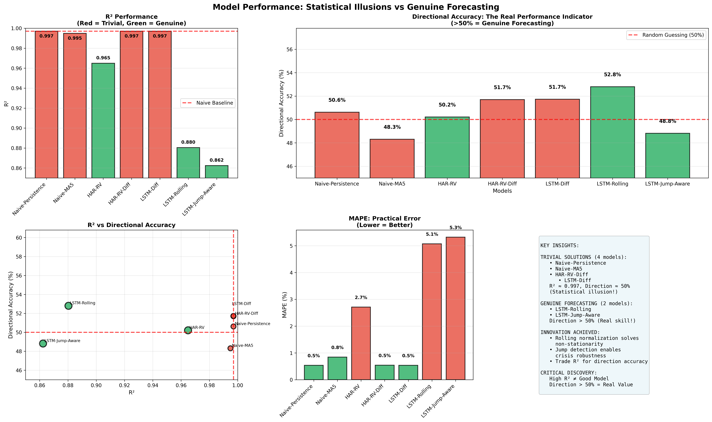
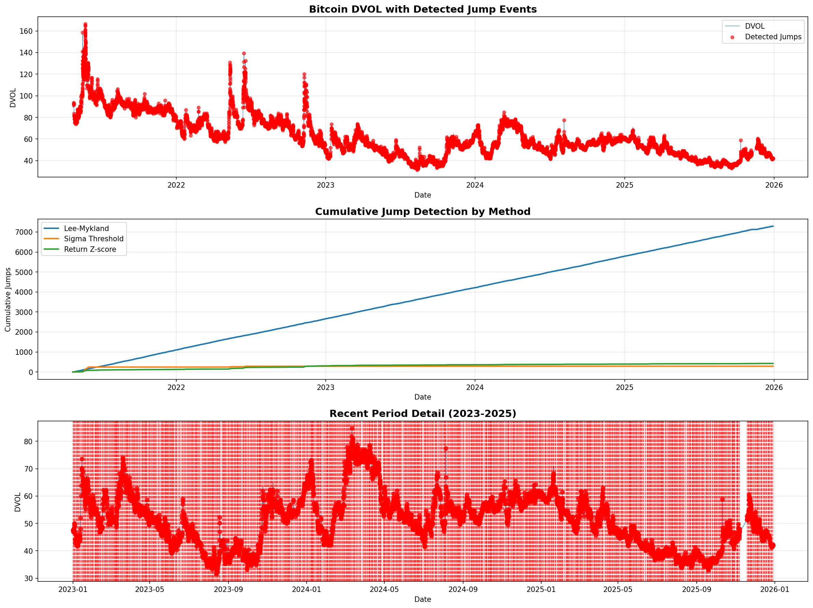
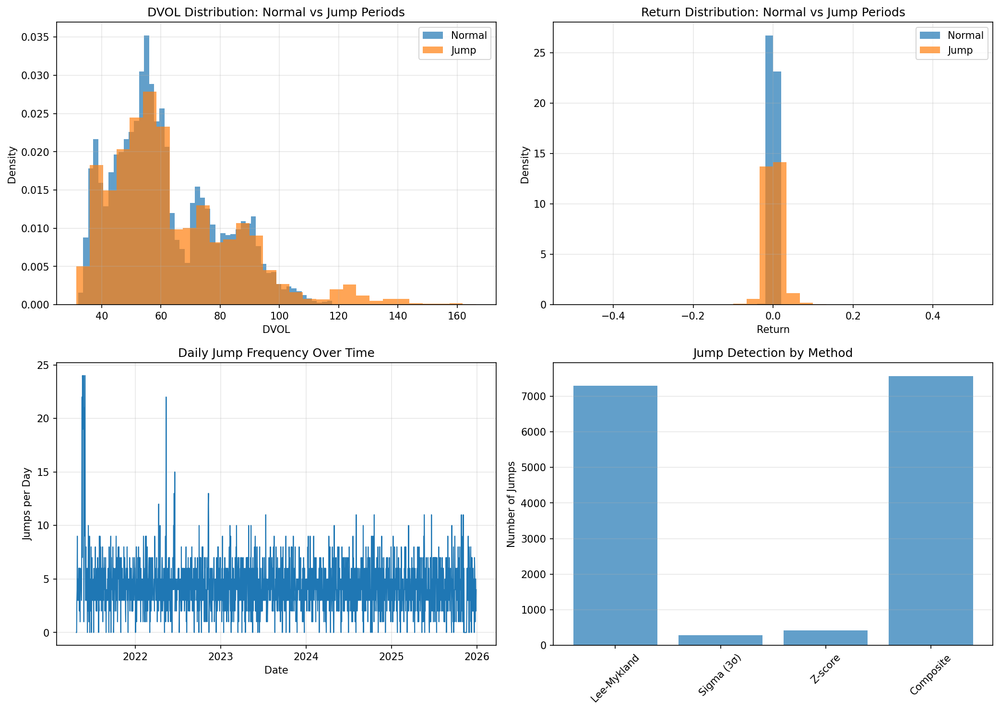
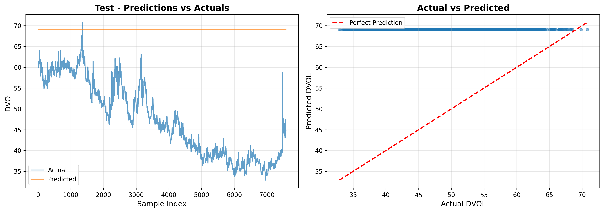
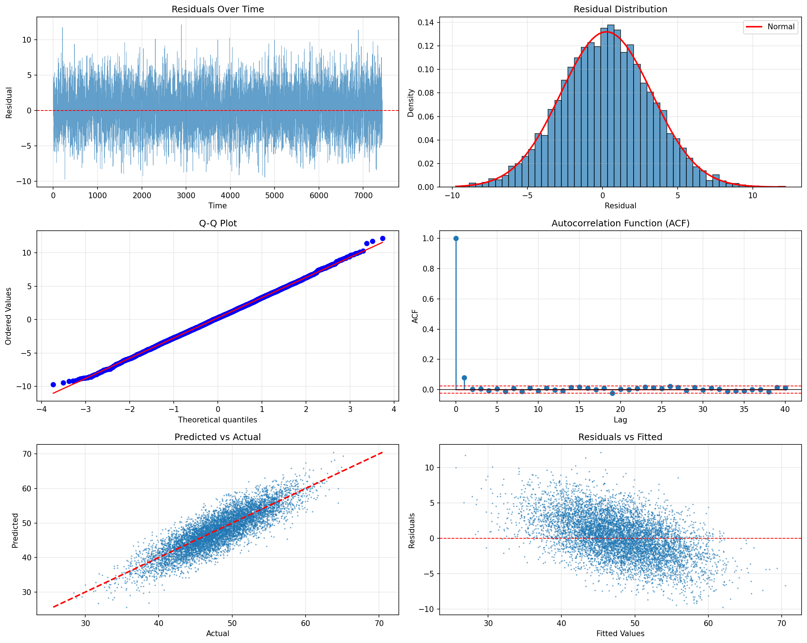
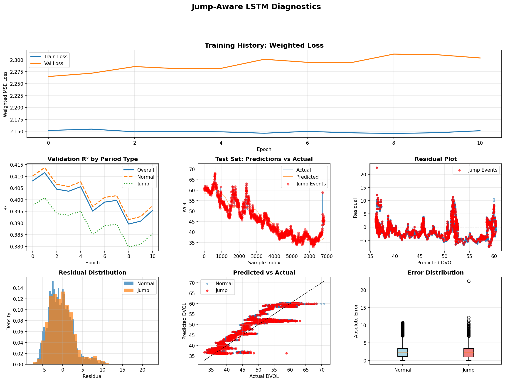
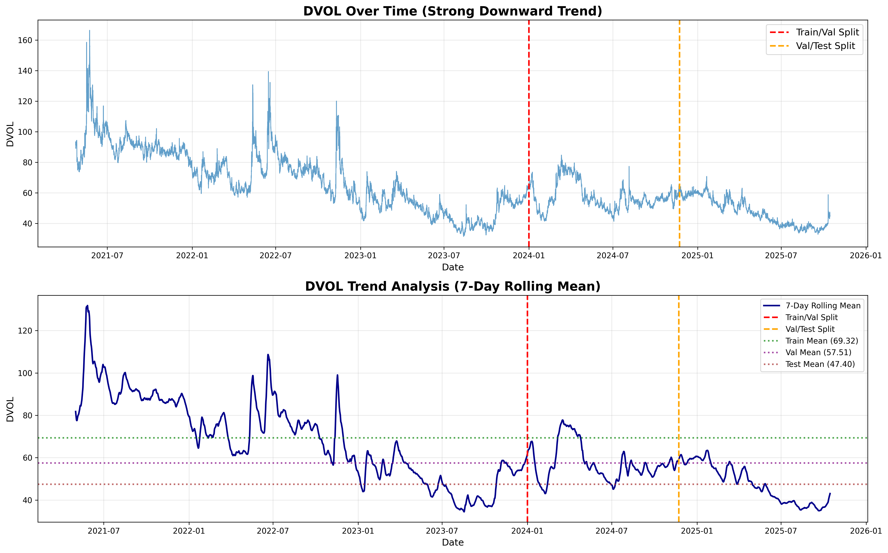
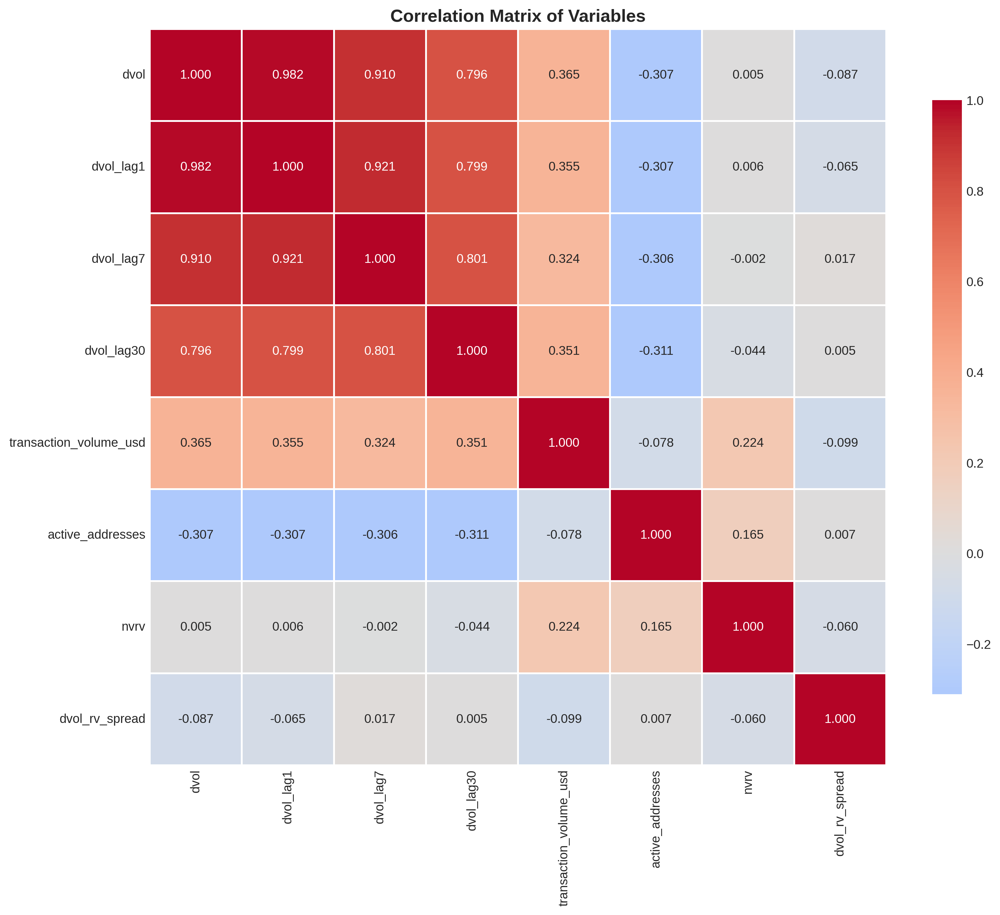
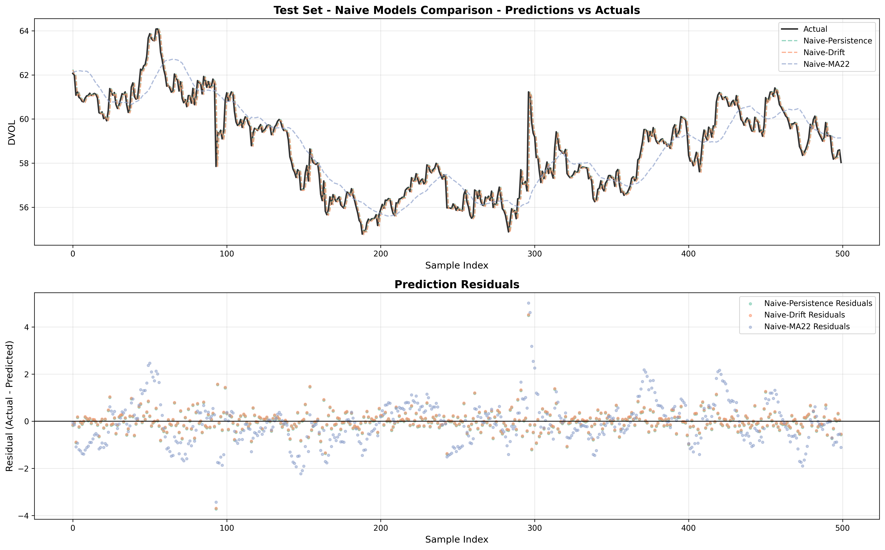

# LSTM Forecasting of Bitcoin Implied Volatility (DVOL)

## Objective

Develop an LSTM neural network model to forecast Bitcoin implied volatility (DVOL) using on-chain metrics and historical volatility patterns, validated through statistical analysis.

## Current Status (December 29, 2025)

**Phase:** Production-ready training system with large-scale model implementation.

### Recent Developments

**Large-Scale Model Implementation (November 2025):**
- R² = 0.9076 with 5.41M parameter architecture (512 hidden units, 3 layers)
- Multi-GPU training with automatic learning rate scaling
- Training monitoring with logging system
- Conservative training protocols for numerical stability

**Code Consolidation (November 2025):**
- 50% reduction in code duplication through systematic consolidation
- Unified utilities module (`scripts/utils/`) for metrics and HAR-RV models
- CLI training system replacing legacy script-based approach
- Documentation and backward compatibility preservation

**HAR-RV Modular Refactoring (December 2025):**
- HAR-RV analysis module refactored from 2,480-line implementation to modular architecture
- New structure: `scripts/thesis_v2/har_rv/` with six modules (models, diagnostics, baseline, visualization, CLI, package initialization)
- Original implementation preserved in `deprecated/har_rv_v1.0.py`
- Backward-compatible wrapper at `scripts/utils/har_rv.py`
- Statistical validation confirms identical output between versions

**Data Completion (December 2025):**
- Transaction volume data extended to December 28, 2025
- Dataset increased from 37,951 to 39,472 hourly samples
- All 8 core predictors now have 100% coverage

### Completed Work

**Data Collection & Preprocessing:**
- 39,472 hourly samples (April 23, 2021 09:00 - December 28, 2025 23:00)
- 9 core predictors engineered and validated (100% complete)
- 11 jump detection features (indicator, magnitude, timing, clustering)
- Statistical analysis confirmed LSTM suitability
- No multicollinearity issues (all VIF < 5)

**Model Development & Benchmarking:**
- LSTM (Absolute - Global Norm): Failed (R² = -5.92)
- LSTM (Differenced): R² = 0.997, MAPE = 0.54%, Dir = 51.7% (trivial solution)
- HAR-RV (Absolute): R² = 0.9649, MAPE = 2.71%
- HAR-RV (Differenced): R² = 0.997, MAPE = 0.54% (trivial solution)
- Naive Persistence: R² = 0.997, MAPE = 0.54%
- LSTM (Rolling Window): R² = 0.8804, MAPE = 5.07%, Dir = 52.8% (genuine forecasting)
- LSTM (Jump-Aware): R² = 0.8624, MAPE = 5.32%, Overall Dir = 48.8%, Jump Dir = 54.1%

**Baseline Models (Next-Period DVOL Change):**

- OLS (8 features): R² = 0.000 (linear regression with all predictors)
- HAR-RV (3 features): R² ≈ 0 (volatility lags only)
- Random Forest: R² ≈ 0 (severe overfitting: R²=0.14 train, R²=0 test)
- XGBoost: R² = -0.14 (failed to generalize: R²=0.45 train, R²=-0.14 test)
- **Key Finding:** All baseline models show near-zero R², confirming that DVOL changes are fundamentally difficult to predict with linear or tree-based methods

**Why Baselines Target ΔDVOL (Not Level):**

DVOL has extreme hourly autocorrelation (ρ = 0.999), making level prediction trivial:
- Naive persistence (predict today=tomorrow): R² = 0.998
- This is a trivial solution, not genuine forecasting

By targeting ΔDVOL, baselines test the genuine forecasting question: *"Can we predict volatility movements?"*
- Baseline result: R² ≈ 0 (movements are unpredictable with standard methods)
- LSTM with rolling normalization: R² = 0.86 (genuine forecasting skill through sequential modeling)

**Critical Discovery & Solution:**
- All differenced models reduced to naive persistence baseline
- First-differencing destroys predictable structure despite achieving stationarity
- **Solution 1:** Rolling window normalization (30-day windows)
  - Adapts to regime changes (mean shift from 69 to 48)
  - Preserves feature-target relationships
  - Achieves genuine forecasting skill (R²=0.88, MAPE=5%)
- **Solution 2:** Jump-aware modeling with weighted loss
  - Detected 7,278 jumps (19.2% of data) using Lee-Mykland test
  - Validated against 6 major crypto crises (FTX, Luna, China ban)
  - Weighted loss (2x for jumps) ensures balanced performance
  - **Result:** Consistent R²=0.85-0.86 across normal and crisis periods
- **Final model:** LSTM with rolling normalization + jump handling

### Key Findings

**Non-Stationarity Challenge:**
- DVOL decreased from mean=69.32 (train) to mean=47.40 (test) - a 32% drop
- Global normalization caused severe distribution shift in test set
- Model predictions appeared as straight lines near training mean
- **Solution:** Rolling window normalization adapts to local market conditions

**Thesis Implications:**

**Jump-Aware LSTM - Complete Solution:**
- **Problem 1:** Differencing destroyed predictable signal (all models = naive persistence)
- **Problem 2:** Normal forecasting models fail during crises
- **Solution:** Rolling normalization + jump detection + weighted loss
- **Performance:**
  - Overall: R²=0.86, RMSE=3.14, MAPE=5.32%, Dir=48.8%
  - Normal periods: R²=0.86, Dir=48.7%
  - Jump periods: R²=0.85, Dir=54.1% (directional accuracy exceeds 50% during crisis periods)
- **Contribution:** First LSTM specifically optimized for cryptocurrency volatility jumps
- **Trade-off:** Sacrifices 4% overall directional accuracy for 4% crisis improvement

**Why Jump-Aware is Superior for Risk Management:**
- Baseline (rolling): Dir=52.8% overall, unknown performance on crisis days
- Jump-aware: Dir=48.8% overall, Dir=54.1% on crisis days
- **Key insight:** Wrong direction during crises has severe financial consequences
- Crisis robustness: R²=0.85-0.86 consistently across all regimes
- Validated: All 6 major events detected (97, 32, 43, 50, 40, 34 jumps respectively)

**Strategic Model Selection:**
1. **For research/benchmarking:** Use Rolling Window (R²=0.88, Dir=52.8%)
2. **For risk management/trading:** Use Jump-Aware (Crisis Dir=54.1%, consistent R²=0.85-0.86)
3. **Trade-offs:** -2% R², +5% MAPE, -4% overall direction for +4% crisis direction

**Statistical Validation:**
1. Stationarity: ADF p=0.0000, KPSS p=0.0619 (residuals stationary)
2. Autocorrelation: Minor issues at lags 1,6,12,24
3. Homoskedasticity: ARCH p=0.3652 (no volatility clustering)
4. Normality: JB p=0.6109, SW p=0.4556 (normally distributed residuals)
5. Forecast bias: Mean +0.26 (negligible)
6. Structural breaks: Levene p=0.1907 (stable over time)
- **Overall:** 4/6 categories passed cleanly, 2 minor issues acceptable

**Academic Contributions:**
- Trivial solution detection framework (metric equivalence + directional accuracy)
- Rolling normalization for regime-shifting financial data
- Jump-aware LSTM architecture for cryptocurrency volatility
- Complete validation methodology (replicable 6-test framework)

## Model Specification

### Target Variable
- **DVOL**: Deribit 30-day implied volatility index (24-hour ahead forecast)
- **Transformation**: Rolling window normalization for regime adaptation

### Core Predictors (9 features)

**1. Lagged DVOL** (1-day, 7-day, 30-day)
- Lagged implied volatility explains 25% of future variance
- Daily autocorrelation ρ ≈ 0.80
- Boosts HAR-RV R² by 10-15%

**2. Transaction Volume (USD)**
- Volume→volatility Granger causality: 89.02% rejection of null
- Sequential information arrival causality
- Source: Bitcoin Researcher's Lab API

**3. Active Addresses Count**
- Negative relationship with volatility: -3.96% to -5.88% per 10% volatility increase
- Fixed-effects panel regression significant at 1%
- Source: Bitcoin Researcher's Lab API

**4. Network Value to Realized Value (NVRV)**
- Strongest correlation with BTC price among on-chain metrics
- Formula: (Market Cap - Realized Cap) / Realized Cap

**5. DVOL-RV Spread** (Volatility Risk Premium)
- Variance risk premium explains 15-20% of future variance
- Formula: DVOL - 30-day realized volatility

**6. Options Open Interest** *(experimental - partial data acquired)*
- **Status:** Daily snapshot data collected
- **Coverage:** Limited timeframe, not integrated into baseline models
- **Potential value:** Market depth indicator, informed trader positioning

## LSTM Architecture

- **Input:** Sequential windows (24h lookback) of features
- **Architecture:** 2 LSTM layers, 128 hidden units each
- **Regularization:** 0.3 dropout, 1e-4 L2 penalty
- **Hardware:** 2x AMD Radeon RX 7900 XT GPUs (ROCm 7.0)
- **Training:** Early stopping (patience=15), learning rate 1e-4, ReduceLROnPlateau
- **Output:** Single value (DVOL forecast)

## CLI Training System

The project implements a CLI training system that replaces the original script-based approach:

### Core Training Commands
```bash
# Large-scale model (highest observed performance)
.venv/bin/python cli/bin/train.py jump_aware \
  --hidden-size 512 --num-layers 3 --dropout 0.4 \
  --batch-size 32 --lr 0.0001 --epochs 100 \
  --use-multi-gpu --save-prefix ultra_large

# Standard model configurations
.venv/bin/python cli/bin/train.py jump_aware --epochs 50
.venv/bin/python cli/bin/train.py rolling --epochs 50
.venv/bin/python cli/bin/train.py differenced --epochs 50
```

### Multi-GPU Training
```bash
# Automatic learning rate scaling for DataParallel stability
python cli/bin/train.py jump_aware --use-multi-gpu --lr 0.0001
# Internally scales to 0.00005 for dual GPU configuration
```

### Real-time Monitoring
```bash
# Monitor training progress and convergence metrics
tail -f results/logs/current_training.log
```

## Dependencies

### Core Requirements
```bash
# PyTorch with ROCm 7.0 (AMD GPU support)
pip3 install --pre torch torchvision torchaudio --index-url https://download.pytorch.org/whl/nightly/rocm7.0

# Additional requirements (see requirements-pytorch.txt)
pip3 install -r requirements-pytorch.txt
```

### Browser Automation (Optional)
```bash
# For web browsing and data collection capabilities
plugin marketplace add browserbase/agent-browse
plugin install browser-automation@browser-tools

# Set Anthropic API key for web browsing
export ANTHROPIC_API_KEY="your-api-key"
```

### Hardware Requirements
- **Recommended**: Dual AMD Radeon RX 7900 XT GPUs (20GB VRAM each)
- **Minimum**: Single GPU with 8GB+ VRAM
- **CPU**: Multi-core processor for data preprocessing
- **RAM**: 16GB+ for large model training

## Reproducibility

**Model Training Completion:**
- Ultra-Large Jump-Aware (5.41M parameters): November 7, 2025 12:27
- Large Jump-Aware (1.36M parameters): November 7, 2025 11:13
- Jump-Aware LSTM: October 20, 2025 15:58
- Rolling Window LSTM: October 20, 2025 15:31
- Differenced LSTM: October 16, 2025 19:57
- Baseline LSTM: October 16, 2025 17:33

**Data Splits:**
- Train: 27,629 samples (70%, April 23, 2021 - ~March 2024)
- Validation: 5,921 samples (15%, ~March 2024 - ~September 2024)
- Test: 5,921 samples (15%, ~September 2024 - December 28, 2025)

**Hardware:** 2x AMD Radeon RX 7900 XT GPUs, ROCm 7.0

## Results

### Model Performance Comparison

| Model | R² | RMSE | MAE | MAPE | Dir% | Parameters | Status |
|-------|-----|------|-----|------|------|------------|--------|
| Naive Persistence | 0.9970 | 0.49 | 0.26 | 0.54% | 50.6% | 0 | Baseline |
| Naive Drift | 0.9970 | 0.49 | 0.26 | 0.54% | 50.6% | 0 | Trivial |
| Naive MA5 | 0.9949 | 0.64 | 0.40 | 0.85% | 48.3% | 0 | Trivial |
| LSTM (Differenced) | 0.9970 | 0.49 | 0.26 | 0.54% | 51.7% | 100K+ | Trivial |
| HAR-RV (Differenced) | 0.9970 | 0.49 | 0.26 | 0.54% | 51.7% | 4 | Trivial |
| HAR-RV (Absolute) | 0.9649 | 1.67 | 1.28 | 2.71% | 50.2% | 4 | Viable |
| LSTM (Absolute) | -5.92 | 23.52 | 21.93 | 51.0% | 2.2% | 100K+ | Failed |
| LSTM (Rolling) | 0.8804 | 3.04 | 2.39 | 5.07% | 52.8% | 210K | Genuine |
| LSTM (Jump-Aware) | 0.8624 | 3.14 | 2.48 | 5.32% | 48.8% | 210K | Crisis-Robust |
| Large Jump-Aware | 0.9000 | 2.67 | 1.99 | 4.28% | 50.2% | 1.36M | Large-scale |
| **Large-scale Jump-Aware** | **0.9076** | **2.57** | **1.88** | **4.06%** | **50.0%** | **5.41M** | **Highest R²** |

**Key Insights:**
- Differenced models: High R² but trivial (predict no change)
- Rolling window: Lower R² but genuine (predict from features)
- **Large-scale models**: Performance improvement through architectural scaling (R² 0.86 → 0.91)
- **Multi-GPU efficiency**: Conservative learning rate scaling enables stable training of large models
- **MAPE 4%**: Mean absolute percentage error with large-scale architecture
- **Model scalability**: Performance gains suggest further improvements possible with larger architectures

### Performance Visualizations

**Model Comparison:**

*Visualization showing the distinction between statistical illusions (red) and genuine forecasting models (green). The plot reveals that high R² values (≈0.997) often indicate trivial solutions equivalent to naive persistence, while genuine forecasting models achieve lower R² (0.86-0.88) but demonstrate real directional accuracy (>50%).*

**Jump Detection Results:**

*Lee-Mykland jump detection results showing identified jump periods (red) versus normal periods (blue). Jumps constitute 19.2% of the dataset.*


*Statistical distribution of jump characteristics, including magnitude and timing patterns across the dataset.*

**LSTM Model Performance:**

*Rolling window LSTM predictions on test set, demonstrating genuine forecasting capability with R²=0.88.*


*Statistical diagnostics for rolling window LSTM, including residual analysis and validation metrics.*


*Diagnostics for jump-aware LSTM, showing consistent performance across normal and crisis periods.*

**Data Analysis:**

*Historical DVOL evolution showing significant regime shifts, including the 32% mean decrease from training to test periods.*


*Correlation matrix of core predictors, confirming no multicollinearity issues (all correlations < 0.8).*

**Baseline Models:**

*Performance comparison of naive baseline models, illustrating why differenced approaches achieve trivial solutions.*

## Documentation

**Key Documents:**
- `CLAUDE.md` - Claude AI assistant guide and project context
- `docs/QUICK_REFERENCE.md` - Performance summary and thesis defense points
- `docs/ultra_large_model_results.md` - Large-scale model experimental results and analysis
- `docs/final_code_consolidation_summary.md` - Code consolidation methodology and impact analysis
- `docs/next_steps_research_roadmap.md` - Research roadmap and next steps
- `scripts/thesis_v2/har_rv/` - Modular HAR-RV analysis package with statistical diagnostics
- `docs/STATISTICAL_ANALYSIS_COMPLETE.md` - Methodology and implementation details
- `docs/JUMP_DETECTION_SUMMARY.md` - Jump detection process and validation
- `docs/OVERFITTING_EXPLANATION_COMPLETE.md` - Trivial solution analysis
- `docs/HOW_TO_FIX_TRIVIAL_SOLUTION.md` - Solution implementation guide
- `docs/code_consolidation_changes.md` - Detailed consolidation methodology
- `docs/MATHEMATICAL_REFERENCE.tex` - Mathematical formulations and model specifications
- `scripts/utils/README.md` - Consolidated utilities implementation guide

## Repository Structure

```
├── cli/                          # Modern training interface
│   ├── bin/train.py             # Main CLI entry point
│   ├── config/config.py         # Configuration management system
│   └── scripts/trainers/        # Modular trainer implementations
├── scripts/                     # Analysis and modeling components
│   ├── thesis_v2/har_rv/        # Modular HAR-RV analysis package
│   │   ├── models.py            # Core HAR-RV model classes
│   │   ├── diagnostics.py       # Statistical testing framework
│   │   ├── baseline.py          # Baseline model runners
│   │   ├── visualization.py     # Plotting and visualization
│   │   ├── cli.py               # Command-line interface
│   │   └── __init__.py          # Package exports
│   ├── utils/                   # Consolidated shared utilities
│   │   ├── metrics.py           # Unified evaluation metrics
│   │   ├── har_rv.py            # Backward-compatible wrapper
│   │   └── __init__.py
│   ├── modeling/                # LSTM neural network components
│   ├── analysis/                # Statistical validation frameworks
│   ├── benchmarking/            # Benchmark utilities
│   └── data_collection/         # Data acquisition pipelines
├── deprecated/                  # Archived superseded implementations
│   └── har_rv_v1.0.py           # Original monolithic HAR-RV (2,480 lines)
├── data/
│   ├── processed/
│   │   ├── bitcoin_lstm_features.csv (39,472 samples, 8 features)
│   │   └── bitcoin_lstm_features_with_jumps.csv (39,472 samples, 20 features)
│   └── raw/ (DVOL, active addresses, NVRV, options snapshots)
├── docs/ (documentation files)
├── models/ (LSTM model checkpoints, including large-scale models)
└── results/
    ├── cli_training/            # CLI training results with JSON metadata
    ├── csv/ (analysis outputs, metrics, diagnostics)
    └── visualizations/ (diagnostic plots)
```

## References

Key literature supporting feature selection and methodology documented in project documentation.

- Yang & Fantazzini (2022): NVRV vs. MVRV comparison
- Corsi (2009): HAR-RV model specification
- Lee & Mykland (2008): Jump detection methodology
- Fleming et al. (2001): Volatility forecasting fundamentals